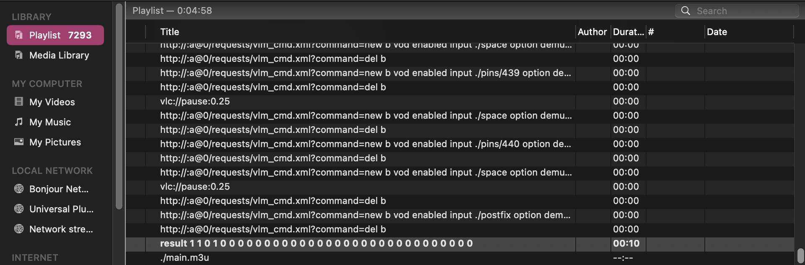

# VLC Logic Gates

Have you ever wanted to evaluate boolean circuits with VLC?
No?
Well now you can.

Just run `run.sh` and it will start VLC (setup for MacOS).
This uses VLCs HTTP server and the VOD VLM feature (soon to be removed rip) to
concat files to emulate lookup tables (which implement the logic gates).

This uses the [Bristol format](https://nigelsmart.github.io/MPC-Circuits/old-circuits.html)
for defining circuits.
`adder_32bit.txt` in `./circuits` is from [here](https://nigelsmart.github.io/MPC-Circuits/adder_32bit.txt).

Circuit evaluation this way is slooow, as I need to inject a 0.25 second delay
every few steps in the playlist, as otherwise VLC will add its own delays
which makes it even slower.
Adding two 32bit ints takes 5 minutes...

## License

MIT
